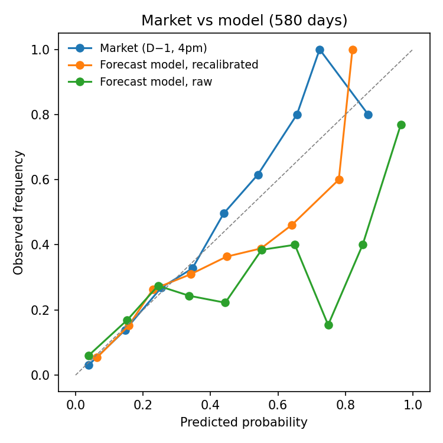
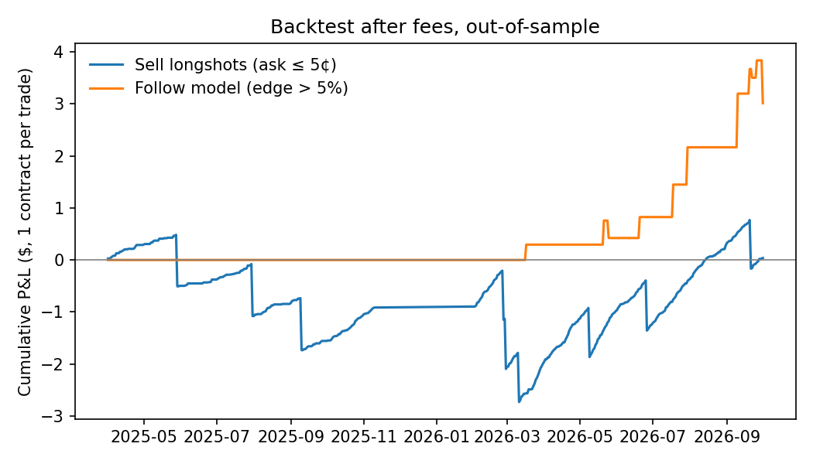

# Are weather prediction markets efficient?

**Kalshi's New York daily-high-temperature markets vs. public weather forecasts, 2023–2026**

Kalshi lists a contract every day on New York's Central Park high temperature,
split into six ranges (e.g. "82–83°F"). Each contract pays $1 if the temperature
lands in its range, so its price can be read as the market's probability.
This project asks whether those prices are well calibrated, and whether a free,
public weather model still contains information the market has not priced in.

## Main findings

1. **The market is well calibrated, and clearly beats a single public forecast model.**
   On 580 days with reliable quotes (Jul 2024 – Oct 2026), the market's Brier score is
   **0.111**, against 0.131 for a GFS-based model after recalibration and 0.197 for
   climatology.
2. **The forecast model still carries a small amount of extra information.** In a logistic
   regression of outcomes on both the market and the model probability, the model term is
   positive and significant (coef. 0.12, t = 2.4, standard errors clustered by day). Out of
   sample, combining the two improves the Brier score only marginally (0.1099 → 0.1095).
3. **A favourite–longshot bias exists but is smaller than trading fees.** Contracts priced
   at 5¢ or less resolve "yes" 1.7% of the time against an average price of 2.4%, yet
   systematically selling them breaks even after fees (+$0.04 over 799 trades). The P&L
   path shows the classic pattern of many small gains and occasional large losses.
4. **Trading on the model signal is suggestive, not conclusive.** A strategy that trades
   when the combined probability differs from the quote by more than 5 points earns
   +$3.01 over 16 trades (t = 1.6). The sign is positive at every threshold tried, but the
   sample is small, the thresholds were not fixed in advance, and fills at the quoted price
   are assumed.
5. **The market matured quickly.** The median widest bid–ask spread on a day fell from
   79¢ in 2023 to 2¢ in 2026, so most 2023–early 2024 days are excluded as unreliable.

<p align="center">
  
  
</p>

## Data

| Source | What | Period |
|---|---|---|
| Kalshi public API | 8,223 settled contracts (series `HIGHNY` / `KXHIGHNY`), settlement temperatures, hourly bid/ask candles | 2023 – Oct 2026 |
| Open-Meteo Previous Runs API | Hourly 2 m temperature forecasts as issued 24 h and 48 h ahead, GFS and ECMWF IFS | 2023 – Oct 2026 (ECMWF from 2024) |

## Method

**Avoiding look-ahead bias.** Every comparison uses only information available at the
time. Market prices are taken at 4 pm New York time on the day before. The forecast used
is the one issued 48 hours ahead of each hour, since some 24-hour-ahead forecasts for late
in the day were issued after 4 pm the previous day. Error statistics and calibration
models are always fitted on earlier data only (rolling or expanding windows).

**Matching the settlement rules.** The National Weather Service defines a day in local
standard time, so during daylight saving the "day" runs from 1 am to 1 am. Daily forecast
highs are computed on the same basis. Integer ranges are mapped to continuous intervals,
e.g. "82–83°" → [81.5, 83.5).

**From forecast to probability** (`step4`). No free archive of ensemble forecasts covers
this period, so probabilities are built from the point forecast plus its recent error
distribution: daily high ~ Normal(forecast + bias, σ), with bias and σ estimated from the
previous 30 days. GFS errors are strongly seasonal (it runs about 3.5°F too warm in summer
and 2.5°F too cold in winter), which is why a short window works better than a long one.

**Recalibration** (`step5`). The raw model is overconfident: events given 95% happen about
65% of the time. A logistic regression on logit(p), refitted each month on past data
only, shrinks its probabilities (slope ≈ 0.5).

**Market probabilities** (`step5`). Mid-price at the snapshot, normalised so the six
ranges sum to one. Days where any range has a spread above 10¢ are dropped.

**Incremental information and backtest** (`step6`). Logistic regression of outcomes on
logit(market) and logit(model), with day-clustered sandwich standard errors: the six
contracts on a day are not independent, since exactly one resolves "yes". Backtests
trade one contract at the quoted bid/ask and pay the Kalshi taker fee
0.07 × P × (1 − P) per contract.

## Limitations

- Only one city, and the reliable sample covers about two years.
- The model uses one deterministic forecast. A forecaster using ensembles, NWS forecasts
  or station-level statistical corrections would likely do better.
- Some parameters (30-day window, 4 pm snapshot, trading thresholds) were chosen after
  looking at the data. A cleaner design would fix them on early data and test on later data.
- Backtests ignore order-book depth and fee rounding on small orders.

## Next steps

- Forward test: log model signals and market prices daily from now on, with no
  after-the-fact changes.
- Add more cities and ensemble forecasts.
- Study how the gap between market and model changes as settlement approaches.

## Reproduce

```bash
python -m venv .venv && source .venv/bin/activate
pip install -r requirements.txt
python src/step1_fetch_markets.py     # contracts and outcomes
python src/step2_fetch_prices.py      # hourly prices (slow: ~8,000 requests)
python src/step3_fetch_forecasts.py   # archived forecasts
python src/step4_forecast_model.py    # forecast → probabilities
python src/step5_compare.py           # market vs model
python src/step6_edge.py              # incremental information and backtest
```

Raw data is not included in the repository; the scripts download it.
